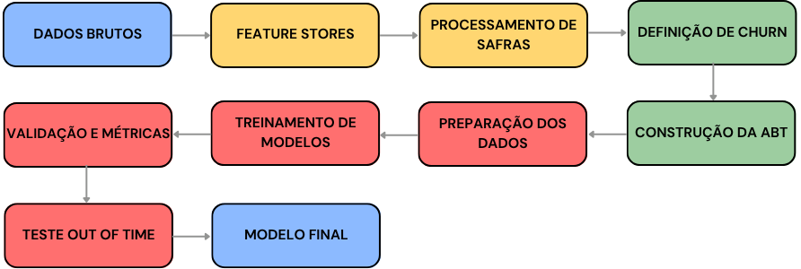

# Data Science & Points: Previsão de Churn

## Sobre o Projeto

Este projeto foi desenvolvido como parte do curso [Data Science & Points](https://github.com/TeoMeWhy/ds-points) do [Téo Me Why](https://teomewhy.org), onde foi construída uma solução completa de Data Science para prever churn de usuários em um sistema de pontos.

O objetivo principal é identificar padrões e comportamentos que possam indicar quando um usuário está prestes a abandonar a plataforma, permitindo ações preventivas para aumentar o engajamento.

## Fluxograma



## Conceitos Importantes

### Churn
Representa o abandono ou desistência de um usuário. No contexto deste projeto, um usuário é considerado em churn quando não apresenta atividade por mais de 21 dias consecutivos.

### Base Ativa
Foi definida como 21 dias, ou seja, se dentro de 22 dias uma pessoa não tivesse atividade, considera-se que um churn ocorreu. Este atraso foi definido para dar "uma chance maior" aos usuários, diminuindo o impacto excessivo da variável `recência` no modelo.

### Cohort (ou Safra)
Grupo de instâncias que compartilham uma característica comum relacionada ao tempo de entrada ou ocorrência. No projeto, trabalhou-se inicialmente com safras de 21 dias e posteriormente com safras mensais, permitindo analisar o comportamento dos grupos ao longo do tempo de forma comparável.

### Analytical Base Table (ABT)
Tabela estruturada e limpa que contém uma linha por instância de análise (ex: cliente, transação, evento) e colunas (variáveis) que descrevem essa instância. Foi preparada especificamente para alimentar os modelos de machine learning.

### Out of Time (OOT)
Consiste em testar o modelo com dados de um período diferente daquele usado para treinamento e validação. Isso é crucial para verificar se o modelo continuará funcionando no futuro e em cenários ainda não vistos, identificando possíveis drifts (mudanças nas características dos dados ao longo do tempo).

### Maturação da Base de Dados
Como a análise exige uma janela de 21 dias após cada transação, a base só é considerada "madura" até 21 dias antes da data mais recente disponível. Transações após esse limite foram excluídas, garantindo comparações consistentes.

Para reduzir o viés gerado por usuários com múltiplas transações no mesmo mês, aplicou-se uma restrição mantendo apenas as transações realizadas no primeiro dia de cada mês, tratando cada ocorrência mensal como uma instância independente de análise.

## Resultados do Modelo Base

O modelo Random Forest com GridSearch obteve os seguintes resultados:

| Base  | Acurácia | Curva ROC | Precisão | Recall   |
| :---: | :---:    | :---:     | ---:     | :---:    |
| **Train** | 0.819401  | 0.913987  | 0.770598 | 0.845745 |
| **Test**  | 0.747634  | 0.817416  | 0.684848 | 0.801418 |
| **OOT**   | 0.741602  | 0.814528  | 0.669291 | 0.594406 |

## Tecnologias Utilizadas

- Python
- Pandas
- Scikit-learn
- SQLite
- Matplotlib/Seaborn

## Instalação e Configuração

```bash
# Criar ambiente virtual
conda create --name ds_churn python=3.9
conda activate ds_churn

# Instalar dependências
pip install -r requirements.txt
```
